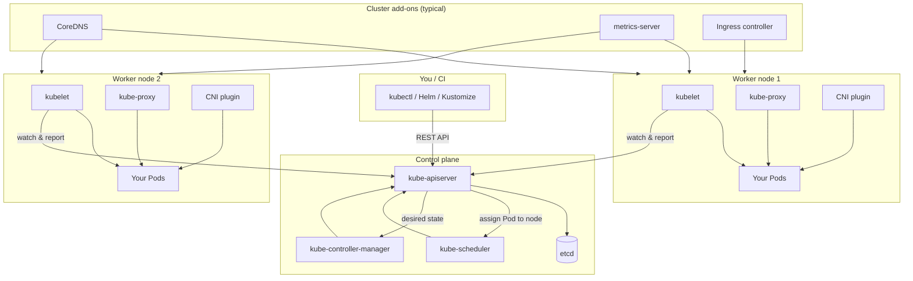
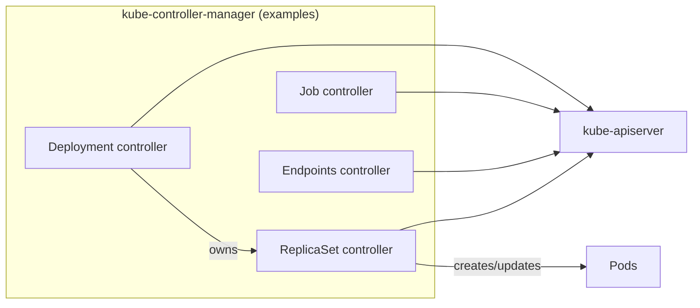
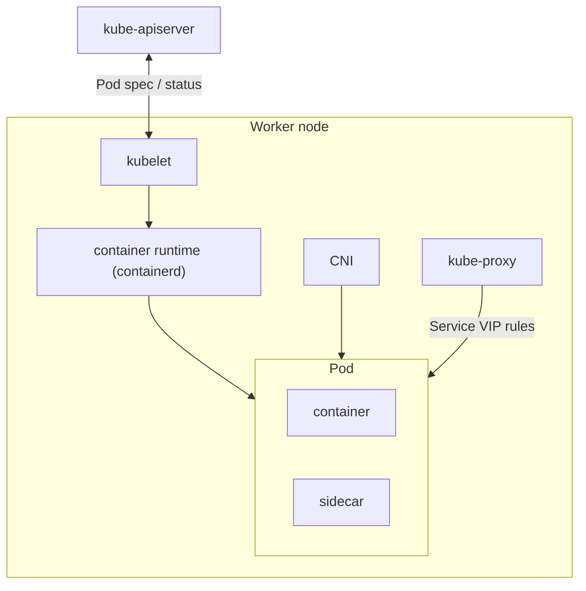
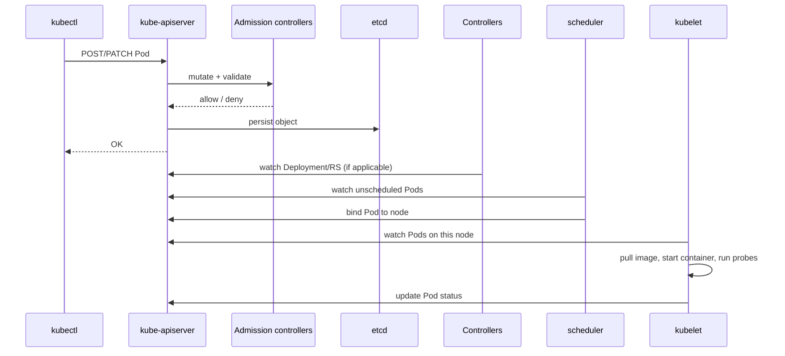
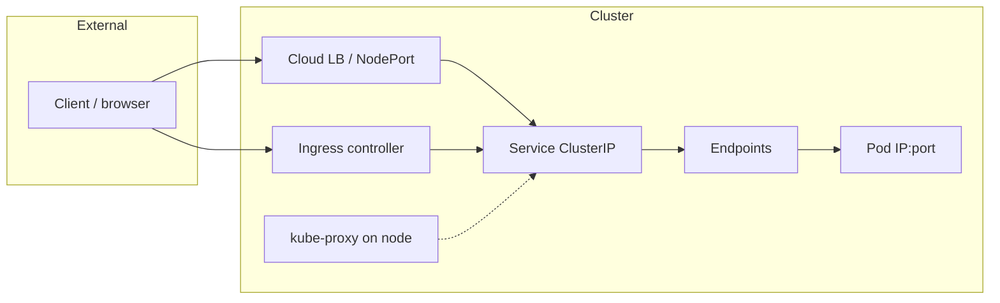
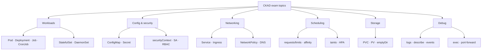

# Kubernetes Cluster Architecture

A working Kubernetes cluster has two main planes: the **control plane** (brains — decides what should run) and the **data plane** (muscle — runs your workloads on nodes).

Read this **before module 01** if you are new to Kubernetes. CKAD is mostly about the data plane (Pods, Services, Ingress), but understanding the control plane helps you interpret `kubectl` output, events, and scheduling failures.

## CKAD relevance

| Area | CKAD hands-on? | Why learn it |
|------|----------------|--------------|
| kube-apiserver, etcd | Background | Explains where manifests live and why `kubectl` talks to an API |
| scheduler, controllers | Background | Explains `Pending` Pods and Deployment reconciliation |
| **kubelet, kube-proxy, CNI** | **Indirect** | Explains node networking, Service routing, probe execution |
| **CoreDNS** | **Yes** | Service discovery (`svc.namespace.svc.cluster.local`) |
| **metrics-server** | **Yes** | Required for HPA and `kubectl top` |
| Ingress controller | **Yes** | Ingress resources need a controller to work |
| Admission webhooks | Low (CKS) | Know they exist between API accept and etcd store |

---

## 1. Cluster at a glance

---

## 2. Control plane components

Runs on control-plane node(s). You rarely configure these on CKAD, but you **interact with their effects** constantly.

| Component | Responsibility |
|-----------|----------------|
| **kube-apiserver** | Front door to the cluster. Validates and serves all API requests (`kubectl`, controllers, kubelet). Only component that talks to etcd. |
| **etcd** | Distributed key-value store. Holds **all cluster state** (objects, desired spec). Source of truth. |
| **kube-scheduler** | Watches unscheduled Pods. Picks a **node** based on resources, affinity, taints, etc. |
| **kube-controller-manager** | Runs controllers (Deployments, ReplicaSets, Jobs, endpoints, etc.). Reconciles **actual state → desired state**. |
| **cloud-controller-manager** | Cloud-specific controllers (LoadBalancer Services, node routes). Only on cloud clusters. |

**CKAD example:** You `kubectl apply` a Deployment → Deployment controller creates ReplicaSet → ReplicaSet controller creates Pods → scheduler assigns each Pod to a node → kubelet starts containers.

---

## 3. Worker node components

Each worker node runs your application workloads.

| Component | Responsibility |
|-----------|----------------|
| **kubelet** | Agent on the node. Registers node, watches Pod specs from API server, starts/stops containers via **container runtime** (containerd/CRI-O). Runs **liveness/readiness/startup probes**. |
| **kube-proxy** | Maintains network rules on the node so **Services** work (ClusterIP, NodePort, LoadBalancer backend). Usually iptables or IPVS. |
| **CNI plugin** | Container Network Interface — assigns **Pod IPs**, connects Pods to the cluster network. Required for **NetworkPolicies** (Calico, Cilium, etc.). |
| **Container runtime** | Actually runs containers (containerd, CRI-O). Not part of Kubernetes binary, but required. |

**CKAD example:** Pod stuck `Pending` → scheduler or resources. Pod `CrashLoopBackOff` → kubelet + container logs. Service has no endpoints → labels/selectors (Endpoints controller), not kube-proxy.

---

## 4. Cluster add-ons (not core, but required in practice)

Installed separately; not built into `kube-apiserver`.

| Add-on | Responsibility | CKAD |
|--------|----------------|------|
| **CoreDNS** | DNS for Services and Pods (`my-svc.default.svc.cluster.local`) | **High** — service discovery |
| **metrics-server** | Resource usage API for `kubectl top` and **HPA** | **High** — HPA tasks |
| **Ingress controller** | Implements Ingress rules (NGINX, Traefik, etc.) | **High** — Ingress without controller does nothing |
| **CNI with NetworkPolicy** | Enforces NetworkPolicy rules | **High** — policies ignored without supporting CNI |

---

## 5. What happens when you `kubectl apply -f pod.yaml`

1. **kubectl** sends manifest to **kube-apiserver**.
2. **Admission** may mutate (defaults, labels) or reject (policy engines — see module 15).
3. Object stored in **etcd**.
4. **Controllers** create child objects (e.g. ReplicaSet → Pods).
5. **Scheduler** assigns Pod to a node (`spec.nodeName`).
6. **kubelet** on that node pulls the image and runs the container; reports status back.

---

## 6. Networking path (CKAD-focused)

| Hop | Component | Your YAML |
|-----|-----------|-----------|
| HTTP routing by host/path | Ingress controller + **Ingress** resource | `networking.k8s.io/v1 Ingress` |
| Stable virtual IP + load balance | **Service** + Endpoints + kube-proxy | `v1 Service` |
| Pod-to-Pod traffic rules | **CNI** + NetworkPolicy | `networking.k8s.io/v1 NetworkPolicy` |
| Name → IP | **CoreDNS** | Service name in app config |

Deep dive: [16-ServicesIngressAndNetworkingFundamentals](../16-ServicesIngressAndNetworkingFundamentals/readme.md).

---

## 7. Where CKAD tasks live on this map

| You write YAML for… | Plane | Module |
|-------------------|-------|--------|
| Deployment, Pod, probes | Data plane (kubelet) | 01, 05 |
| Service, Ingress, NetworkPolicy | Data plane + add-ons | 16 |
| ConfigMap, Secret, RBAC | API objects (enforced at admission/runtime) | 11 |
| PVC, StorageClass | API + kubelet mount | 01, 06 |
| HPA | API + metrics-server | 12 |

---

## 8. Control plane vs data plane — one sentence each

| Plane | Question it answers |
|-------|---------------------|
| **Control plane** | *What should the cluster look like?* (store spec, schedule, reconcile) |
| **Data plane** | *What is actually running on this node right now?* (containers, network, storage mounts) |

**CKAD** = mostly configuring objects the control plane stores, and verifying the data plane behaves correctly.

---

## Related modules

- Workloads on nodes: [01-WorkloadandContainerImageFundamentals](../01-WorkloadandContainerImageFundamentals/readme.md)
- API request flow & admission: [15-PolicyDrivenGovernanceAndAdmissionControl/01](../15-PolicyDrivenGovernanceAndAdmissionControl/01-AdmissionControllerFundamentals/readme.md)
- Networking detail: [16-ServicesIngressAndNetworkingFundamentals](../16-ServicesIngressAndNetworkingFundamentals/readme.md)
- Troubleshooting: [08-DebuggingAndTroubleshootingApplications](../08-DebuggingAndTroubleshootingApplications/readme.md)
- Exam study order: [17-CKADExamEssentials](../17-CKADExamEssentials/readme.md)
